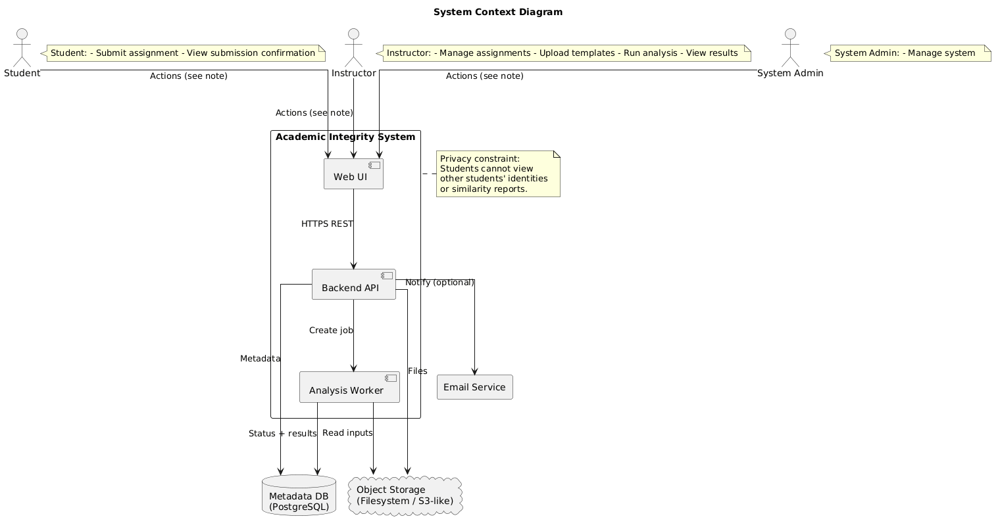

# Code Plagiarism Detector

> A full-stack source-code similarity review platform for programming assignments, built as a six-person capstone project for Brock University COSC 4P02.


## Overview

Code Plagiarism Detector is a web application that helps instructors identify suspicious similarities across student programming submissions. It supports assignment management, student archive uploads, historical submissions, template-code exclusion, asynchronous comparison jobs, and an evidence viewer that highlights matching regions between source files.

The project was delivered by a six-person capstone team, with responsibilities spanning frontend development, backend services, background processing, database design, similarity-engine work, testing, documentation, and project coordination.

## Competition Result

This capstone was evaluated through a class-wide round-robin competition designed to test the robustness of each team's plagiarism-detection system. Our group ranked **3rd overall in the class**.

The competition considered multiple practical factors, including:

- Correctly detecting positive plagiarism cases.
- Rejecting false positives.
- System stability and availability during testing.
- The engine's ability to analyze submitted code.
- The clarity and usefulness of the output shown to reviewers.

This result reflected both the technical implementation and the team's ability to deliver a working, reviewable system under competitive evaluation conditions.

## Why It Matters

Manual plagiarism review is time-consuming and often difficult to scale across large programming classes. This system helps instructors move from raw submission archives to structured, reviewable similarity evidence by:

- Automating source extraction from zipped student submissions.
- Comparing current submissions against each other and against historical submissions.
- Separating code similarity from comment-based supporting evidence.
- Reducing false positives by masking instructor-provided template code.
- Providing a web-based workflow for upload status, result review, and pair-by-pair evidence inspection.

## Key Features

- **Instructor dashboard** for creating assignments, managing due dates, and viewing comparison status.
- **Student submission portal** with assignment-key based uploads.
- **Client-side identity encryption** using RSA-OAEP before student identity data is sent to the server.
- **Bulk archive ingestion** for current and historical submissions.
- **Template upload support** to exclude starter code from similarity scoring.
- **Background processing pipeline** using Redis and BullMQ workers.
- **Rust similarity engine** using token normalization, Tree-sitter parsing, and Greedy String Tiling.
- **Supported languages:** Java, C, and C++.
- **Evidence viewer** for side-by-side pair review with highlighted code and comment matches.
- **Professor-only controls** for revealing encrypted submission identities when review context is needed.
- **Download and cleanup tools** for submissions, templates, and assignment artifacts.
- **Dockerized deployment** with separate web, API, worker, database, Redis, and Caddy services.

## Tech Stack

| Layer | Technologies |
| --- | --- |
| Frontend | Next.js 15, React 19, TypeScript, Tailwind CSS, TanStack Query, Monaco Editor, Lucide Icons |
| API | NestJS 11, Fastify, TypeScript, cookie-based sessions |
| Worker | Node.js, TypeScript, BullMQ, Redis, archive extraction with `fflate` |
| Similarity Engine | Rust, Tree-sitter, Greedy String Tiling, JSON engine contract |
| Database | PostgreSQL 16, Prisma ORM, Prisma migrations |
| Storage | Filesystem-backed object storage abstraction |
| Infrastructure | Docker, Docker Compose, Caddy reverse proxy |

## System Architecture

The capstone documentation includes the following system context diagram, showing the main actors, application boundary, backend services, storage, and privacy constraint around student identity visibility.



The system is organized as a monorepo:

```text
apps/
  api/       NestJS API for auth, assignments, uploads, comparisons, and health checks
  web/       Next.js application for professor and student workflows
  worker/    BullMQ workers for upload preparation and comparison processing
engine/      Rust workspace containing the parser, GST engine, contracts, and CLI
packages/
  shared/    Shared TypeScript domain types, queue names, storage, and engine contracts
prisma/      Database schema, migrations, seed, and bootstrap scripts
```

## Core Workflow

1. A professor creates an assignment and receives an assignment key.
2. Students upload zipped source-code submissions through the student portal.
3. The API stores the archive and queues upload preparation.
4. The worker extracts relevant source files, builds deterministic concatenated source maps, and persists prepared submissions.
5. The professor uploads optional template code and historical submissions.
6. A comparison run is queued and processed asynchronously.
7. The Rust engine parses and normalizes source code, masks template matches, computes pair similarity, and returns match spans.
8. Results are stored and displayed in the professor dashboard and pair evidence viewer.

## Documentation Binder

In addition to the source code, the project includes a documentation binder prepared for capstone review and stakeholder handoff. These documents can be linked or uploaded to the repository for reviewers who want to see the full planning, requirements, design, installation, and maintenance process.

| Document | Purpose |
| --- | --- |
| `00_Cover_Page_and_Table_of_Contents.pdf` | Binder cover page and document index |
| `01_Access_Guide_to_Website.pdf` | Website access and navigation guide |
| `02_SRS_V2.pdf` | Software requirements specification |
| `03_Theory_of_Operation.pdf` | System behavior and operational overview |
| `04_Technical_Specification.pdf` | Technical design and implementation details |
| `05_Installation_Guide.pdf` | Setup and deployment instructions |
| `06_User_Manual.pdf` | End-user guide for the application |
| `07_Maintenance_Manual.pdf` | Maintenance and support documentation |
| `08_Issue_Resolution_Guide.pdf` | Troubleshooting and issue resolution guide |

## Installation and Setup

### Prerequisites

- Node.js 22+
- npm
- Docker and Docker Compose
- Rust toolchain, if running the engine outside Docker
- PostgreSQL and Redis, if running services manually instead of through Docker

### 1. Clone and Install

```bash
git clone [Add repository URL here]
cd code-plagiarism-detector
npm ci
```

### 2. Configure Environment

```bash
cp .env.example .env
```

Update the required values in `.env`, especially:

- `DATABASE_URL`
- `REDIS_URL`
- `NEXT_PUBLIC_API_BASE_URL`
- `CORS_ALLOWED_ORIGINS`
- `ENGINE_BINARY_PATH`
- `OBJECT_STORAGE_ROOT`
- `PUBLIC_UPLOAD_STATUS_TOKEN_SECRET`
- `SUBMISSION_IDENTITY_KEY_ID`
- `SUBMISSION_IDENTITY_PUBLIC_KEY_PEM_BASE64`
- `SUBMISSION_IDENTITY_PRIVATE_KEY_PEM_BASE64`
- `ADMIN_BOOTSTRAP_EMAIL`
- `ADMIN_BOOTSTRAP_PASSWORD`

### 3. Build the Rust Engine

```bash
cargo build --manifest-path engine/Cargo.toml --release
```

Set `ENGINE_BINARY_PATH` to the generated binary:

```bash
ENGINE_BINARY_PATH=./engine/target/release/engine-cli
```

### 4. Prepare the Database

```bash
npm run prisma:generate
npm run db:migrate:dev
npm run db:bootstrap-admin
```

For demo data:

```bash
npm run db:seed
```

The seed script creates a demo professor account and assignment key:

```text
Email: professor@example.com
Password: professor123
Assignment key: demo-key-1234
```

## Running the Application

### Development

Start PostgreSQL and Redis, then run:

```bash
npm run dev
```

Typical local URLs:

- Web app: `http://localhost:3000`
- API health check: `http://localhost:3001/health/live`
- API readiness check: `http://localhost:3001/health/ready`

### Docker

```bash
docker compose up --build
```

The Compose setup starts:

- `postgres`
- `redis`
- `api`
- `worker`
- `web`
- `caddy`

## Useful Commands

```bash
# Build all TypeScript workspaces
npm run build

# Generate Prisma client
npm run prisma:generate

# Apply development migrations
npm run db:migrate:dev

# Apply committed migrations for deployment
npm run db:migrate:deploy

# Reset local development database
npm run db:reset:dev

# Run Rust workspace tests
cargo test --manifest-path engine/Cargo.toml --workspace
```

## Team and Role Breakdown

This was completed as a **six-person group capstone project**:

| Team Member | Role / Contribution |
| --- | --- |
| Muhammad Nabeel Waheed | Project coordination, system design, technology selection, Agile facilitation, and full-stack development |
| Ghassan Balouze | Main coding contributor across core application implementation |
| Kevin Akpinar | Backend development and server-side implementation support |
| Abdel Zahran | Backend development and server-side implementation support |
| Ty Mabee | Coding contributor and implementation support |
| Thomas Neal | Testing, quality assurance, validation support, and defect reporting |

## Project Leadership and Coordination

Project coordination responsibilities included:

- Coordinating a six-person team across planning, implementation, testing, and delivery.
- Facilitating Agile ceremonies including sprint planning, standups, reviews, and retrospectives.
- Translating high-level capstone goals into manageable sprint tasks and milestones.
- Tracking progress, blockers, and integration risks across frontend, backend, worker, and engine work.
- Helping align technical decisions with user workflows for professors and students.
- Supporting teammates with task breakdown, code integration, and delivery priorities.
- Keeping the project focused on a working end-to-end product rather than isolated components.

## Agile and Project Management Highlights

- Organized work around iterative feature delivery and regular team checkpoints.
- Maintained visibility into task ownership, dependencies, and blockers.
- Prioritized user-facing workflows first: assignment creation, upload, processing, comparison, and review.
- Encouraged integration throughout development to reduce late-stage merge and deployment risk.
- Balanced technical implementation with documentation, demos, and final presentation readiness.

## Technical Accomplishments

- Built a multi-service full-stack architecture with independent web, API, worker, and engine services.
- Designed an asynchronous processing model for long-running upload and comparison jobs.
- Implemented source-map aware concatenation so matched byte ranges can be traced back to original files.
- Integrated a Rust CLI engine into a TypeScript worker pipeline through a versioned JSON contract.
- Used Tree-sitter parsing to normalize Java, C, and C++ source code before comparison.
- Added template-code masking to reduce similarity caused by shared starter files.
- Separated code similarity scoring from comment-match evidence for clearer review context.
- Implemented encrypted student identity handling to support privacy-conscious submission review.
- Modeled assignments, uploads, submissions, templates, comparison runs, pair results, matches, and sessions with Prisma.

## Challenges and Solutions

| Challenge | Solution |
| --- | --- |
| Handling large zipped submissions without blocking the web request cycle | Introduced Redis/BullMQ queues and worker processes for upload preparation and comparison runs |
| Mapping engine results back to original files | Built deterministic source concatenation with persisted source maps and byte offsets |
| Avoiding inflated similarity from instructor starter code | Added template uploads and masking logic before pair scoring |
| Supporting multiple languages | Used Tree-sitter language adapters for Java, C, and C++ parsing |
| Preserving student privacy during submission | Encrypted identity data in the browser and exposed controlled reveal flows for professors |
| Making similarity results reviewable | Built a pair evidence viewer with side-by-side source context and highlighted match regions |

## Future Improvements

- Add committed screenshots and a hosted demo video.
- Add exportable reports for academic integrity review workflows.
- Improve comparison scalability with batching or distributed engine execution.
- Add more language adapters, such as Python or JavaScript.
- Add richer analytics for assignment-level similarity trends.
- Expand automated test scripts and CI configuration.
- Support cloud object storage such as S3 for production deployments.
- Add role-specific audit logs for identity reveal and administrative actions.

## Lessons Learned

- Strong project coordination is as important as technical implementation in a multi-person capstone.
- Long-running workflows benefit from asynchronous architecture early in the design.
- Review tools need explainability, not just scores; instructors need evidence they can inspect.
- Privacy and academic integrity workflows must be designed together, not added at the end.
- Clear interfaces between services, especially the engine contract, make integration work much easier.
